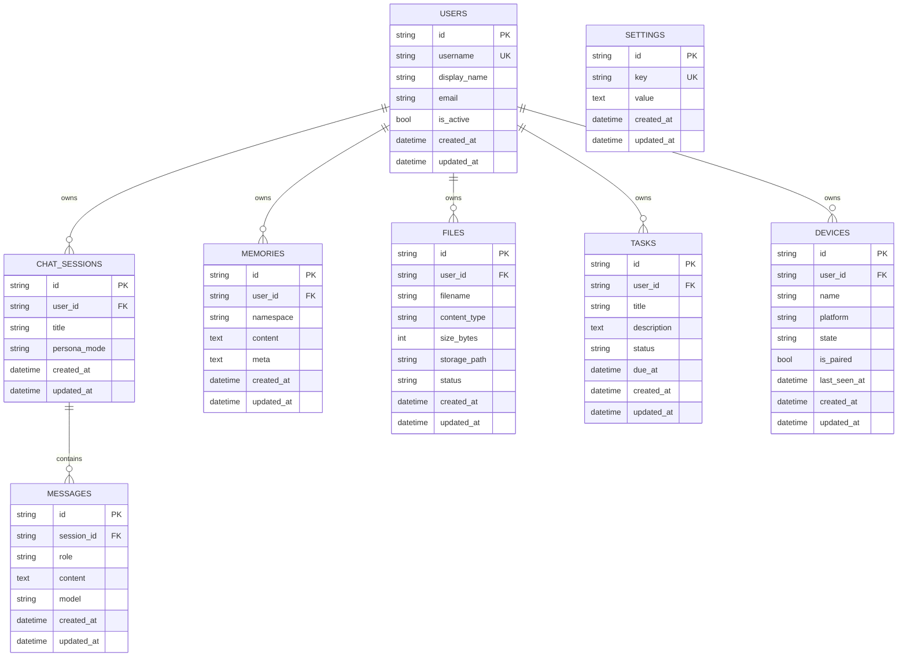

# Miori Core — Data Model

> The persistence layer for Miori Core. **SQLite by default** (`DATABASE_URL=sqlite:///./miori.db`),
> SQLAlchemy 2.0 typed ORM. Every table inherits a string **UUID primary key** and
> `created_at` / `updated_at` timestamps from the shared mixins in
> `services/core-api/app/db/base.py` (`UUIDMixin`, `TimestampMixin`).
>
> Related: [System Overview](system-overview.md) · [API Surface](api-surface.md) · [Feature Matrix](../feature-matrix.md)

Design principles:
- **SQLite-friendly types only** — no native JSON/array columns; structured blobs are stored as `TEXT` (e.g. `memories.meta`).
- **Embeddings are optional** — no vector column in the lite schema; vector recall is an opt-in upgrade (see TODO in `models/memory.py`).
- **Single-user friendly** — `user_id` foreign keys are nullable so Miori runs with zero accounts configured.

---

## ER diagram

---

## Tables

### `users` — `models/user.py`
Account / identity. Designed so single-user installs need no setup.

| Column | Type | Notes |
|---|---|---|
| `id` | string(36) PK | UUID |
| `username` | string(64) | unique, indexed |
| `display_name` | string(128) | nullable |
| `email` | string(255) | nullable |
| `is_active` | bool | default `true` |
| `created_at` / `updated_at` | datetime | mixin |

### `chat_sessions` — `models/session.py`
A single conversation thread. Named `ChatSession` to avoid clashing with SQLAlchemy `Session`.

| Column | Type | Notes |
|---|---|---|
| `id` | string(36) PK | UUID |
| `user_id` | string(36) FK → `users.id` | nullable, indexed |
| `title` | string(255) | default `"New chat"` |
| `persona_mode` | string(32) | `friend` (default) / `operator` / `researcher` / `coder` |
| timestamps | datetime | mixin |

Relationship: one session → many `messages`.

### `messages` — `models/message.py`
Individual turns in a session.

| Column | Type | Notes |
|---|---|---|
| `id` | string(36) PK | UUID |
| `session_id` | string(36) FK → `chat_sessions.id` | indexed |
| `role` | string(16) | `user` / `assistant` / `system` / `tool` |
| `content` | text | default `""` |
| `model` | string(128) | nullable — provider/model that produced an assistant message |
| timestamps | datetime | mixin |

### `memories` — `models/memory.py`
Lightweight namespaced memory store for the lite memory provider.

| Column | Type | Notes |
|---|---|---|
| `id` | string(36) PK | UUID |
| `user_id` | string(36) FK → `users.id` | nullable, indexed |
| `namespace` | string(64) | logical grouping (`facts` / `preferences` / `projects`), default `default`, indexed |
| `content` | text | the remembered text |
| `meta` | text | nullable — JSON-ish blob serialized as text (SQLite-friendly) |
| timestamps | datetime | mixin |

> **Embeddings intentionally absent.** Vector recall is an optional upgrade (Odysseus/Khoj); add an embedding column or external vector reference only when heavy memory is wired in. See [system-overview §6](system-overview.md#low-end-machine-optimization-rules).

### `files` (FileRecord) — `models/file.py`
Stores metadata for uploaded/ingested files.

| Column | Type | Notes |
|---|---|---|
| `id` | String(36) | UUID PK |
| `user_id` | String(36) | Nullable owner |
| `filename` | String | Original or safe name |
| `content_type` | String | Nullable MIME type |
| `size_bytes` | Integer | Raw byte size |
| `storage_path` | String | Local path (under UPLOAD_DIR) |
| `status` | String | e.g. "uploaded", "ingested", "failed" |
| `extracted_text` | Text | Nullable extracted plain text |

### `file_chunks` (FileChunk) — `models/file.py`
Stores indexed chunks of ingested files for semantic search.

| Column | Type | Notes |
|---|---|---|
| `id` | String(36) | UUID PK |
| `file_id` | String(36) | FK to `files.id` (CASCADE) |
| `chunk_index` | Integer | Order of the chunk in the file |
| `content` | Text | Chunk text |
| `embedding` | JSON | Nullable vector embedding |
| `created_at` | DateTime | | mixin |

### `settings` — `models/setting.py`
Key/value application settings + feature flags surfaced to the UI.

| Column | Type | Notes |
|---|---|---|
| `id` | string(36) PK | UUID |
| `key` | string(128) | unique, indexed |
| `value` | text | nullable |
| timestamps | datetime | mixin |

> Boot-time defaults (lite mode, ports, CORS) come from `core/config.py`; the `settings` table holds user-overridable runtime values.

### `tasks` — `models/task.py`
Task lifecycle for the Tasks page and automation.

| Column | Type | Notes |
|---|---|---|
| `id` | string(36) PK | UUID |
| `user_id` | string(36) FK → `users.id` | nullable, indexed |
| `title` | string(255) | required |
| `description` | text | nullable |
| `status` | string(32) | `pending` / `in_progress` / `done` / `cancelled`, indexed |
| `due_at` | datetime | nullable |
| timestamps | datetime | mixin |

> Scheduling fields (`cron`, `next_run`) are deferred to v0.3 with APScheduler (Khoj patterns).

### `devices` — `models/device.py`
Remote / paired devices for the Remote dashboard.

| Column | Type | Notes |
|---|---|---|
| `id` | string(36) PK | UUID |
| `user_id` | string(36) FK → `users.id` | nullable, indexed |
| `name` | string(128) | display name |
| `platform` | string(32) | nullable (`windows`/`linux`/`macos`) |
| `state` | string(16) | `online` / `offline` / `sleeping`, default `offline` |
| `is_paired` | bool | default `false` |
| `last_seen_at` | datetime | nullable |
| timestamps | datetime | mixin |

> Auth tokens / pairing secrets for secure remote control are deferred (Mark-XLVI patterns) — see TODO in `models/device.py`.

---

## Relationships summary

- `users (1) ── (N) chat_sessions`
- `chat_sessions (1) ── (N) messages`
- `users (1) ── (N) memories | files | tasks | devices`
- `settings` is standalone (global key/value).

All `user_id` FKs are **nullable** to support the zero-config single-user default. Cascades and pairing-secret tables are introduced in later versions (see [TASKS.md](../../TASKS.md)).
