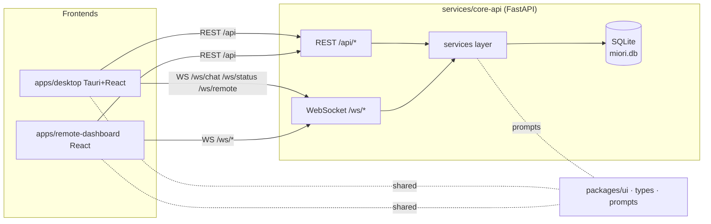
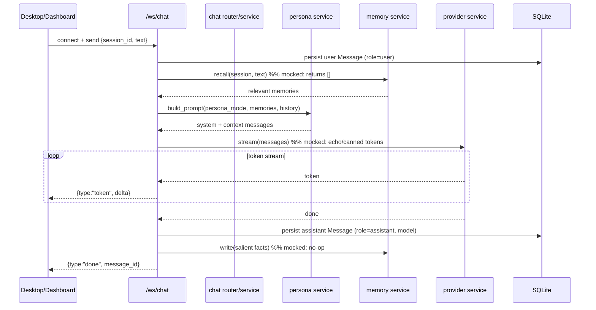

# Miori Core — System Architecture Overview

> Miori Core is a cross-platform **personal AI friend + workstation + remote desktop companion**.
> It must feel like a *friend, not a cockpit*. This document describes the runtime components,
> how they talk, the chat data flow, the backend service abstractions, the DB schema, and the
> rules that keep Miori usable on low-end machines.
>
> Related: [Feature Matrix](../feature-matrix.md) · [Data Model](data-model.md) · [API Surface](api-surface.md) · [Visual Inspirations](../ui-spec/visual-inspirations.md) · [TASKS.md](../../TASKS.md)

---

## 1. Components

Miori Core is a **clean modular monorepo**, not a merge of donor repos.

| Component | Path | Stack | Role |
|---|---|---|---|
| **Desktop app** | `apps/desktop/` | Tauri + React + TS + Tailwind + shadcn/ui | Primary native companion. Tabbed workspace (Chat, Files, Memory, Projects, Research, Tasks, Remote, Settings) + presence orb. |
| **Remote dashboard** | `apps/remote-dashboard/` | React + TS + Tailwind (web) | Lightweight browser surface to reach Miori + paired devices from anywhere. Friend-first, not an ops console. |
| **Core API** | `services/core-api/` | Python FastAPI + SQLAlchemy + SQLite | The brain. REST `/api` + WebSocket `/ws`. Owns all services (memory/providers/tools/persona/planner/executor/vision/audio/remote/tasks/files) and persistence. |
| **Shared packages** | `packages/` | TS (`ui`, `types`), prompt assets (`prompts`) | Design system, shared types, persona prompt profiles consumed by both frontends and the API. |

```
                           ┌────────────────────────────────────────┐
                           │            services/core-api            │
                           │  FastAPI  ── REST /api  ── WS /ws        │
                           │                                         │
    apps/desktop  ───────▶ │  routers/ ─▶ services/ ─▶ db (SQLite)   │
    (Tauri shell)          │   chat       memory    models/          │
                           │   memory     providers                  │
    apps/remote-dashboard ▶│   files      persona                    │
    (browser)              │   providers  tools                      │
                           │   persona    planner                    │
         ▲   ▲             │   remote     executor                   │
         │   │             │   tasks      vision                     │
    packages/ui            │   settings   audio                      │
    packages/prompts       └────────────────────────────────────────┘
    packages/types
```

- **Frontends are thin.** All intelligence (persona, memory, provider routing, tools) lives in `core-api`. The Tauri shell and the dashboard share the same API contract, so the dashboard is "the desktop app, remotely."
- **Tauri is a shell, not a second backend.** Rust side (`apps/desktop/src-tauri/`) handles window/native concerns only; it does not duplicate business logic.

---

## 2. How components communicate

Two transports, one API namespace:

- **REST `/api/*`** — request/response: CRUD, config, uploads, one-shot calls. See [api-surface](api-surface.md).
- **WebSocket `/ws/*`** — streaming + push: token-by-token chat (`/ws/chat`), live status/heartbeat (`/ws/status`), remote control/presence (`/ws/remote`).



Rule of thumb: **mutations/queries → REST; anything that streams or is pushed → WS.**

---

## 3. Data flow for a chat message

End-to-end path of a single user message (tonight: persona + provider + memory are **mocked**, but the flow is real):



Key points:
- The **WebSocket handler orchestrates**; it calls into the service layer (no business logic in the socket).
- **Persistence is real even when intelligence is mocked** — messages/sessions are written to SQLite so the UI history is genuine on day one.
- Memory recall/write and provider streaming are **swappable** behind interfaces; flipping `LITE_MODE` / configuring a provider upgrades behavior without touching the flow.

---

## 4. Service-layer abstractions

Each service is a package under `services/core-api/app/services/` exposing a small interface + a lite default implementation. Heavy backends are alternative implementations behind the same interface.

| Service | Path | Interface (conceptual) | Lite default (tonight) | Upgrade path |
|---|---|---|---|---|
| **memory** | `services/memory/` | `write(namespace, content, meta)`, `search(query, k)`, `recall(session)` | SQLite text store, no embeddings | Embeddings + vector recall (Odysseus/Khoj) — optional dep |
| **providers** | `services/providers/` | `chat(messages)`, `stream(messages)`, `embed(text)`, `list_models()` | Echo/canned provider | OpenAI / Anthropic / Ollama / local — lazy import per provider |
| **tools** | `services/tools/` | `register(tool)`, `list()`, `invoke(name, args)` | Registry with safe no-op/demo tools | Computer-use + shell + browser tools, capability-gated |
| **persona** | `services/persona/` | `build_prompt(mode, ctx)`, `modes()` | Friend-first prompt from `packages/prompts/` | Mode-specific tuned profiles, memory-aware tone |
| **remote** | `services/remote/` | `list_devices()`, `pair()`, `status()`, `relay()` | In-memory device registry, mocked presence | Real transport + pairing secrets (Mark-XLVI patterns) |
| **tasks** | `services/tasks/` | `create/list/update`, `schedule()` | DB-backed CRUD, no scheduler | APScheduler recurring jobs (Khoj patterns) |
| **files** | `services/files/` | `save(upload)`, `ingest(file_id)`, `search(query)` | Save metadata + bytes, ingest = no-op | Parse/chunk/index pipeline (Khoj) |

All services are constructed via a single composition point (factory/DI) so `LITE_MODE` and feature flags decide which implementation is loaded.

---

## 5. Database schema overview

SQLite by default (`DATABASE_URL=sqlite:///./miori.db`). All tables use a string UUID PK and `created_at`/`updated_at` via `UUIDMixin` + `TimestampMixin` (`services/core-api/app/db/base.py`). Full column detail + ER diagram in [data-model.md](data-model.md).

| Table | Model file | Purpose |
|---|---|---|
| `users` | `models/user.py` | Account/identity (single-user friendly) |
| `chat_sessions` | `models/session.py` | A conversation; carries `persona_mode` |
| `messages` | `models/message.py` | Messages in a session (user/assistant/system/tool) |
| `memories` | `models/memory.py` | Namespaced memory; embeddings optional |
| `files` | `models/file.py` | Uploaded file metadata + ingest status |
| `settings` | `models/setting.py` | Key/value app settings + feature flags |
| `tasks` | `models/task.py` | Task lifecycle (scheduling fields later) |
| `devices` | `models/device.py` | Remote/paired devices + presence state |

---

## 6. Low-end-machine optimization rules

Miori **must** stay usable on weak hardware. These are hard rules, not suggestions:

1. **Lazy-load heavy deps.** Embeddings, vector stores, real model SDKs, computer-use, and voice are imported *inside the function that needs them*, never at module import. A fresh boot pulls in only FastAPI + SQLAlchemy + SQLite.
2. **SQLite is the default and is sufficient.** No external DB server required to run Miori. Postgres is an optional, opt-in `DATABASE_URL`.
3. **Lite mode is the default** (`LITE_MODE=True`). Lite mode disables/stubs heavy memory, embeddings, and real providers and runs the echo provider, so the app is fully clickable with zero API keys.
4. **No mandatory vector DB.** Memory works as a plain text store; vector recall is an *optional* enhancement (`models/memory.py` keeps embeddings off by default).
5. **Feature flags gate cost.** `REMOTE_ENABLED`, `LITE_MODE`, and per-provider config live in `core/config.py` + `settings` table; disabled features cost zero runtime resources.
6. **Frontends stay thin.** No heavy 3D scenes or always-on animation loops in the baseline UI; the presence orb uses cheap CSS/transform motion (see [visual-inspirations](../ui-spec/visual-inspirations.md#motion-guidelines)).
7. **Graceful degradation.** Missing prompt dir, missing provider keys, or disabled remote must degrade with a friendly message — never crash the boot.

---

## 7. Module ownership boundaries

To keep the assembly-line build conflict-free (see [overnight build plan](../overnight-plan/build-plan.md)):

| Domain | Owner module/path | May NOT touch |
|---|---|---|
| Native shell / windowing | `apps/desktop/src-tauri/` | backend services |
| Desktop UI pages | `apps/desktop/src/features/*` | API internals (only calls `lib/` client) |
| Remote UI | `apps/remote-dashboard/` | desktop-only code |
| Shared design/types/prompts | `packages/{ui,types,prompts}` | app-specific logic |
| API routing | `services/core-api/app/routers/*` | service internals (only calls services) |
| Streaming/push | `services/core-api/app/ws/*` | REST handlers |
| Business logic | `services/core-api/app/services/*` | routers/ws (no FastAPI imports in services) |
| Persistence | `services/core-api/app/models/*` + `db/*` | service logic |
| Config | `services/core-api/app/core/config.py` | — |
| Docs (this set) | `docs/architecture`, `docs/ui-spec`, `docs/overnight-plan`, `docs/feature-matrix.md`, root `TASKS.md` | `docs/repo-analysis/` (other job), all code |

The dependency direction is strict and one-way:
`routers/ws → services → models/db`. Services must not import routers; the UI must not import service internals (it speaks only HTTP/WS).
